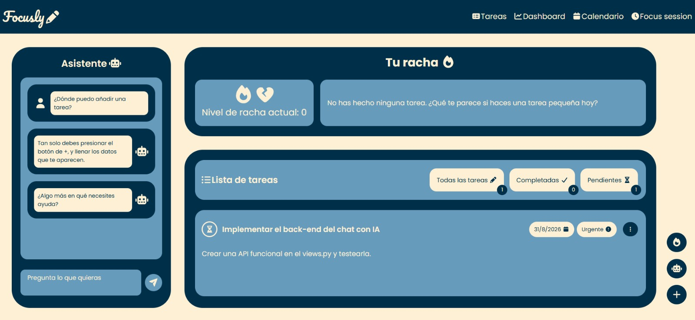

# Focusly ✏

**Focusly** is a productivity web application currently being developed as my final project for **CS50W: Web Programming with Python and JavaScript**.

The application is designed to help users organize their daily activities, maintain focus, and manage their personal workflow through a clean, modern, and responsive interface.

Built with **Django, HTML, CSS, and vanilla JavaScript**, Focusly combines the web development concepts and technologies I have learned throughout CS50W into a single application.

> **Status:** Focusly is currently under development.

---

## Key Features

- **Responsive Interface:** Designed to work across desktop, tablet, and mobile devices.
- **Dashboard:** Centralized interface for accessing productivity information and tools.
- **Streak System:** Tracks user activity and maintains productivity streaks.
- **Interactive Frontend:** Uses vanilla JavaScript to provide dynamic interactions without relying on frontend frameworks.
- **Django Backend:** Server-side application built with Django using its Model-View-Template (MVT) architecture.
- **Modular Templates:** Uses reusable Django templates to keep the interface organized and maintainable.

### Planned Features

- **Task Management:** Create, organize, and track tasks.
- **Interactive Calendar:** Manage and visualize activities through a calendar interface.
- **AI Assistance:** AI-powered features to assist users with productivity and other tasks.

---

## Screenshots




---

## 🛠️ Tech Stack

### Backend
- Python 3.12
- Django

### Frontend
- HTML5
- CSS3
- JavaScript (Vanilla JS)

### Database
- SQLite3

### Development Tools
- Git
- GitHub

---

## 📁 Project Structure

```text
capstone/
├── manage.py
├── db.sqlite3
├── capstone/                  # Main project configuration
│   ├── __init__.py
│   ├── asgi.py
│   ├── settings.py            # Global Django settings
│   ├── urls.py                # Global URL configuration
│   └── wsgi.py                # WSGI configuration
└── focusly/                   # Main application
    ├── static/
    │   └── focusly/
    │       ├── script.js      # Client-side logic
    │       └── styles.css     # Custom styles and layouts
    ├── templates/
    │   └── focusly/
    │       └── index.html     # Main application template
    ├── admin.py               # Django admin configuration
    ├── apps.py                # Application configuration
    ├── models.py              # Database models
    ├── tests.py               # Application tests
    ├── urls.py                # Application URL routing
    └── views.py               # Application views
